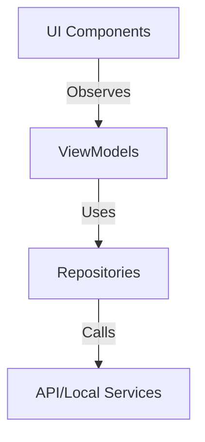
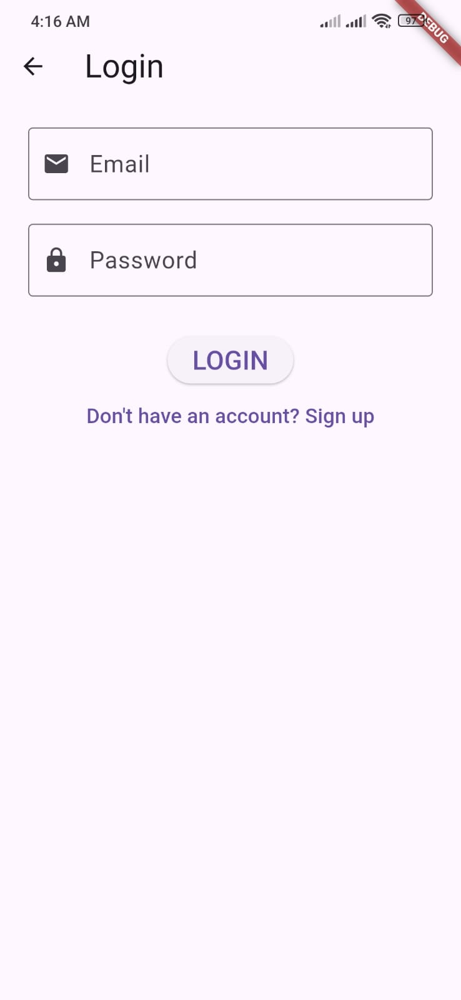
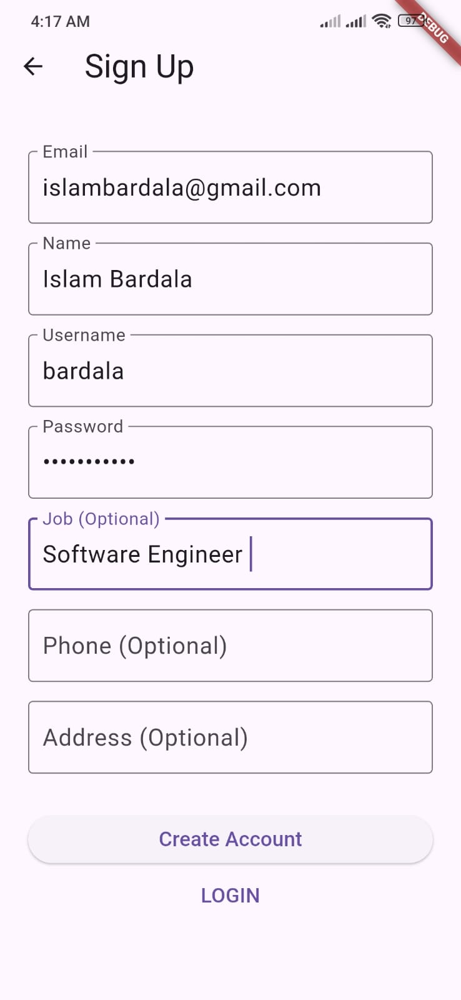
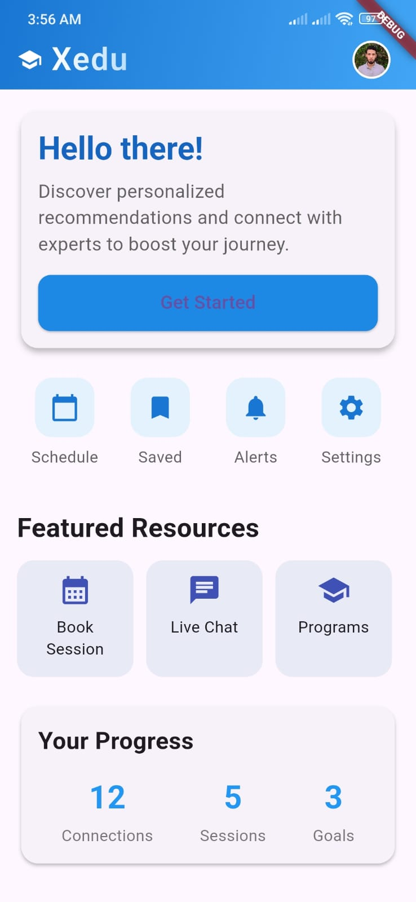
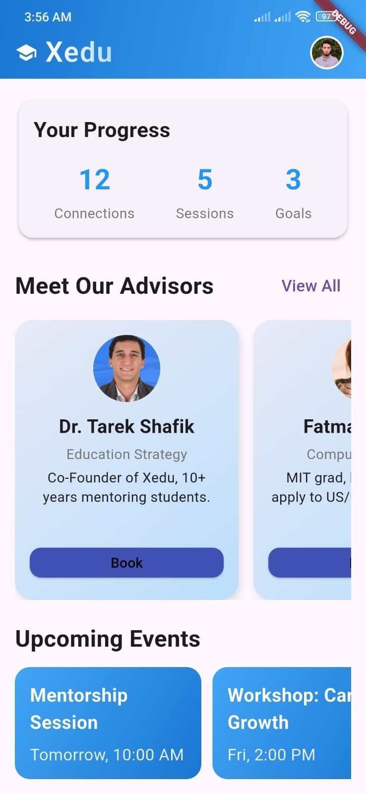
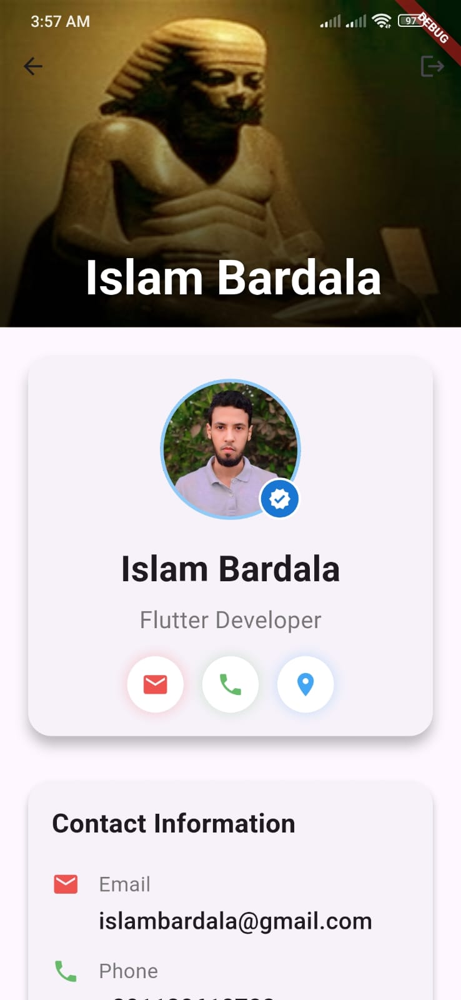
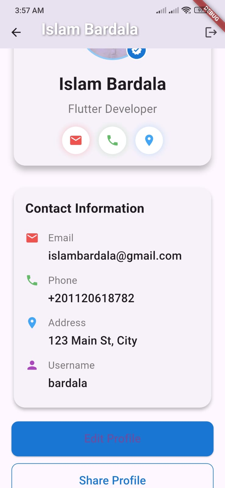

# Xedu Advisor Platform (Flutter MVVM)

A modern Flutter application that connects students with expert advisors around the world. Built using clean architecture principles and the MVVM design pattern, this app focuses on providing a structured, scalable, and visually engaging learning experience.

This project simulates the core logic of a real-world app like Xedu — a social learning platform where learners can explore advisors, view their specialties and availability, and manage their own profile.

---

## ✨ Key Features

- 🧑 View a list of expert advisors with bios, specialties & ratings
- 📱 Beautiful and responsive UI built with custom Flutter widgets
- 👤 Login / Signup with in-memory backend
- 📃 User profile screen with editable details
- 🌐 Advisor data loaded via async REST API (simulated)
- 🚀 Modular MVVM architecture for separation of concerns
- 🧠 Extensible for real-time chat, scheduling, and calendar booking

---

## 📐 Architecture Overview

The project is designed using Clean Architecture and MVVM:

- ✅ Model: Represents data structures like User, Advisor, etc.
- ✅ View: UI widgets and screens built using StatelessWidget & Consumer
- ✅ ViewModel: Manages UI logic, state, and data flow

It leverages the provider package for state management, making ViewModels observable through ChangeNotifier.

---

## 📁 Folder Structure

The project is modularized for clarity and scalability:

lib/
│
├── main.dart # Entry point
├── data/ # Data layer
│ ├── repo/ # Repositories to abstract data sources
│ │ ├── auth_repo.dart
│ │ └── advisor_repo.dart
│ ├── services/ # API and local service handlers
│ │ ├── auth_service.dart
│ │ ├── advisor_service.dart
│ │ ├── auth_local_service.dart
│ │ └── api_config.dart
│
├── models/ # Data models
│ ├── user_model.dart
│ ├── advisor.dart
│ └── login_res.dart
│
├── ui/ # UI layer
│ ├── views/ # Screens
│ │ ├── home/
│ │ │ ├── home_screen.dart
│ │ │ └── widgets/
│ │ ├── login/
│ │ │ ├── login_screen.dart
│ │ │ └── widgets/
│ │ ├── signup/
│ │ │ └── signup_screen.dart
│ │ ├── advisors/
│ │ │ └── advisors_screen.dart
│ │ └── userProfile/
│ │ ├── profile_screen.dart
│ │ └── widgets/
│ │
│ ├── view_model/ # ViewModels (State + Business Logic)
│ │ ├── auth_view_model.dart
│ │ └── advisors_view_model.dart
│ │
│ ├── core/ # Reusable UI components
│ │ └── navigator_button.dart
│ └── themes/ # Theme and style configuration
│
├── routes/
│ └── app_routes.dart # Central route management
│
└── utils/
└── result.dart # Generic Result<T> class

---

## 🧠 How MVVM Works in This App

| Component  | Role                                                        |
| ---------- | ----------------------------------------------------------- |
| Model      | Pure Dart classes (User, Advisor)                           |
| ViewModel  | AuthViewModel, AdvisorsViewModel → holds state & calls Repo |
| View       | StatelessWidget screens → consume ViewModel via Provider    |
| Repository | Abstracts data access (from service or local store)         |
| Service    | Calls remote API (or in-memory mock server)                 |

State flow: View → ViewModel → Repo → Service → API response → ViewModel updates → UI rebuilds.



---

## 🧪 Demo API (Mock)

- Built using Node.js/Express with in-memory DB (no external DB required)
- Endpoints:

  - POST /api/login
  - POST /api/signup
  - GET /api/advisors

You can test it using curl or Postman (see CLI commands in development setup).

---

## 🚀 Getting Started

1. Clone the repo:

```bash
git clone https://github.com/your-name/xedu-flutter-clone.git
cd xedu-flutter-clone
```

2. Install dependencies:

```bash
flutter pub get
```

3. Run the app:

```bash
flutter run
```

4. Run the mock server (optional if you're testing API):

```bash
cd backend/
node index.js
```

---

## 📱 Screens Included

- Login & Signup
- Profile View (with avatar, contact, job, etc.)
- Home Screen
- Advisors list (horizontally scrollable cards)
- Suggested actions bar
- Navigation between pages via route management

---

## 📦 Core Dependencies

- State Management: Provider + ChangeNotifier
- Navigation: Custom router with AppRoutes mixin
- Animation: flutter_animate for smooth transitions

---

## 📸 Screenshots

| 🔐 Login Screen                                       | 📝 Signup Screen                                       | 🏠 Home Screen                                                                                                 | 👤 Profile Page                                                                                                      |
| ----------------------------------------------------- | ------------------------------------------------------ | -------------------------------------------------------------------------------------------------------------- | -------------------------------------------------------------------------------------------------------------------- |
|  |  | <br> | <br> |
